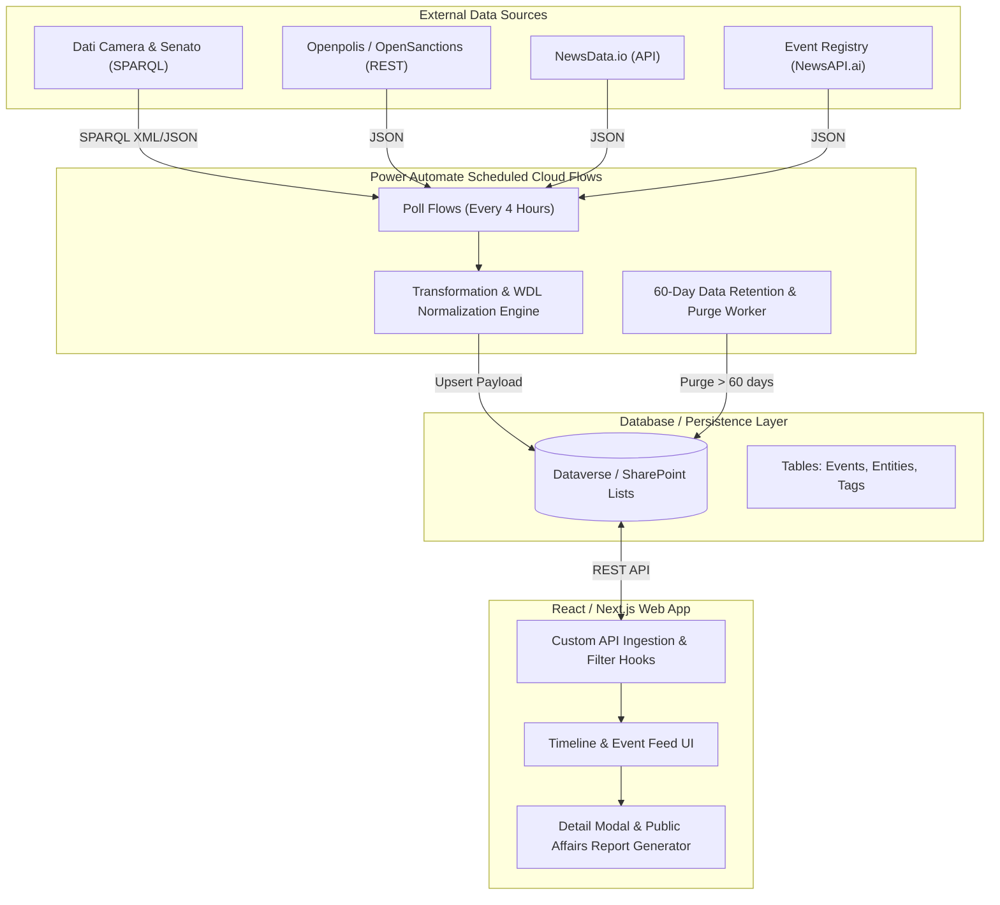

# Italian Political Event Tracker: Enterprise Architecture & Implementation Guide

This document outlines the complete architectural design and step-by-step implementation guide for the **Italian Political Event Tracker Web App**. Built for corporate liaison officers, this solution aggregates real-time political events, normalizes heterogenous legislative and news data sources, and maintains a rolling 60-day searchable archive.

---

## Architecture Overview



---

## 1. Dataverse & SharePoint Table Definitions

### A. Microsoft Dataverse Schema

#### Table 1: `cr_politicalevents` (Events Table)

| Display Name | Schema Name | Data Type | Requirement | Description / Details |
| :--- | :--- | :--- | :--- | :--- |
| Event ID (Primary Key) | `cr_politicaleventid` | Unique Identifier | System | Auto-generated GUID |
| Title | `cr_title` | Single Line of Text (250) | Mandatory | Event title / summary headline |
| Short Description | `cr_description` | Multiple Lines of Text (Plain) | Mandatory | Executive summary paragraph |
| Full Content | `cr_content` | Multiple Lines of Text (Rich/Plain) | Optional | Full transcript / detailed report |
| Event Timestamp | `cr_eventdate` | Date and Time (User Local) | Mandatory | Exact timestamp of floor vote or publication |
| Source Type | `cr_sourcetype` | Choice (OptionSet) | Mandatory | Options: `1: Official`, `2: News` |
| Source Name | `cr_sourcename` | Single Line of Text (100) | Mandatory | e.g. `Dati Camera`, `Dati Senato`, `Openpolis`, `NewsData.io` |
| Source URL | `cr_sourceurl` | Single Line of Text (500) | Optional | Outbound link to official RDF/RDFa or news source |
| Category | `cr_category` | Choice (OptionSet) | Mandatory | Options: `1: Floor Vote`, `2: Committee Meeting`, `3: Political Statement`, `4: Corporate Regulation`, `5: Executive Order` |
| Impact Level | `cr_impactlevel` | Choice (OptionSet) | Mandatory | Options: `1: High`, `2: Medium`, `3: Low` |
| Retention Date | `cr_retentiondate` | Date and Time | System | Automatically set to `cr_eventdate + 60 days` |

#### Table 2: `cr_politicalentities` (Entities / Politicians Table)

| Display Name | Schema Name | Data Type | Requirement | Description / Details |
| :--- | :--- | :--- | :--- | :--- |
| Entity ID (Primary Key) | `cr_politicalentityid` | Unique Identifier | System | Auto-generated GUID |
| Event (Lookup) | `cr_eventid` | Lookup (`cr_politicalevents`) | Mandatory | N:1 relationship to `cr_politicalevents` |
| Full Name | `cr_name` | Single Line of Text (150) | Mandatory | e.g. `Giorgia Meloni`, `Gilberto Pichetto Fratin` |
| Political Party | `cr_party` | Single Line of Text (50) | Optional | e.g. `FdI`, `PD`, `Lega`, `M5S`, `FI` |
| Institutional Role | `cr_role` | Single Line of Text (100) | Optional | e.g. `Prime Minister`, `Minister of Environment`, `Senator` |

#### Table 3: `cr_eventtags` (Tags Table)

| Display Name | Schema Name | Data Type | Requirement | Description / Details |
| :--- | :--- | :--- | :--- | :--- |
| Tag ID (Primary Key) | `cr_eventtagid` | Unique Identifier | System | Auto-generated GUID |
| Event (Lookup) | `cr_eventid` | Lookup (`cr_politicalevents`) | Mandatory | N:1 relationship to `cr_politicalevents` |
| Tag Keyword | `cr_keyword` | Single Line of Text (75) | Mandatory | e.g. `Renewables`, `State Aid`, `PNRR`, `Grid Fee` |

---

### B. SharePoint List Fallback Schema

If using SharePoint Online Lists, construct three linked lists:

1. **`Italian_Political_Events` List**:
   - `Title` (Single line of text)
   - `Description` (Multiple lines of text)
   - `Content` (Multiple lines of text)
   - `EventDate` (Date and Time)
   - `SourceType` (Choice: `Official`, `News`)
   - `SourceName` (Single line of text)
   - `SourceUrl` (Hyperlink)
   - `Category` (Choice: `Floor Vote`, `Committee Meeting`, `Political Statement`, `Corporate Regulation`, `Executive Order`)
   - `ImpactLevel` (Choice: `High`, `Medium`, `Low`)
   - `TagsText` (Single line of text - comma separated keywords)

2. **`Italian_Political_Entities` List**:
   - `Title` (Politician/Entity Name)
   - `EventID` (Single line of text - matching Parent ID)
   - `Party` (Single line of text)
   - `Role` (Single line of text)

---

## 2. Power Automate Cloud Flow Architecture

### Flow A: Scheduled Ingestion & Transformation Worker (Every 4 Hours)

- **Recurrence Trigger**: Runs every 4 hours (`Interval: 4`, `Frequency: Hour`).

#### Step 1: SPARQL Query Action (HTTP to Dati Camera)
- **Method**: `POST`
- **URI**: `https://dati.camera.it/sparql`
- **Headers**:
  - `Accept`: `application/sparql-results+json`
  - `Content-Type`: `application/x-www-form-query`
- **Body Formula**:
```sparql
PREFIX ocd: <http://dati.camera.it/ocd/>
PREFIX dc: <http://purl.org/dc/elements/1.1/>

SELECT DISTINCT ?votazione ?titolo ?data ?esito WHERE {
  ?votazione a ocd:votazione ;
             dc:title ?titolo ;
             dc:date ?data .
  FILTER(?data >= "2026-05-01")
} ORDER BY DESC(?data) LIMIT 20
```

#### Step 2: Ingest NewsData.io & Event Registry
- **HTTP Action 1 (NewsData.io)**: `GET https://newsdata.io/api/1/news?apikey=@{variables('NewsDataKey')}&country=it&category=politics`
- **HTTP Action 2 (Event Registry)**: `POST https://eventregistry.org/api/v1/event/getEvents`
```json
{
  "action": "getEvents",
  "conceptUri": "http://en.wikipedia.org/wiki/Politics_of_Italy",
  "articlesPage": 1,
  "articlesCount": 10,
  "resultType": "events",
  "apiKey": "@{variables('EventRegistryKey')}"
}
```

#### Step 3: WDL Normalization & Record Upsert (Power Automate Expression)
Transform heterogenous JSON into the unified Dataverse `PoliticalEvent` schema:

```json
{
  "title": "@items('Apply_to_each_item')?['titolo']?['value']",
  "description": "@concat('Legislative floor vote processed on ', items('Apply_to_each_item')?['data']?['value'])",
  "eventdate": "@formatDateTime(items('Apply_to_each_item')?['data']?['value'], 'yyyy-MM-ddTHH:mm:ssZ')",
  "sourcetype": 1,
  "sourcename": "Dati Camera",
  "sourceurl": "@items('Apply_to_each_item')?['votazione']?['value']",
  "category": 1,
  "impactlevel": "@if(contains(items('Apply_to_each_item')?['titolo']?['value'], 'Decreto'), 1, 2)"
}
```

---

### Flow B: Scheduled 60-Day Data Retention & Purge Flow (Daily at Midnight)

- **Recurrence Trigger**: Daily at 00:00 UTC (`Frequency: Day`, `Interval: 1`).
- **Dataverse List Records Filter Query**:
```text
cr_eventdate lt @{addDays(utcNow(), -60, 'yyyy-MM-ddTHH:mm:ssZ')}
```
- **Apply to each**: Execute `Delete a record` in Dataverse for each matching GUID.

---

## 3. React Setup & API Ingestion Hooks

### A. Dependencies (`package.json`)
```json
{
  "name": "eu-researcher-politics",
  "version": "1.0.0",
  "dependencies": {
    "next": "^15.1.0",
    "react": "^19.0.0",
    "react-dom": "^19.0.0",
    "lucide-react": "^0.470.0",
    "clsx": "^2.1.1",
    "tailwind-merge": "^2.6.0"
  }
}
```

### B. Custom React Hook: `usePoliticalEvents`
```typescript
import { useState, useEffect, useCallback } from "react";
import { type PoliticalEvent } from "@/lib/types";

interface UsePoliticalEventsParams {
  query?: string;
  sourceType?: string;
  category?: string;
  days?: number;
  party?: string;
}

export function usePoliticalEvents(params: UsePoliticalEventsParams = {}) {
  const [events, setEvents] = useState<PoliticalEvent[]>([]);
  const [loading, setLoading] = useState<boolean>(true);
  const [error, setError] = useState<string | null>(null);

  const fetchEvents = useCallback(async () => {
    setLoading(true);
    setError(null);
    try {
      const searchParams = new URLSearchParams();
      if (params.query) searchParams.set("q", params.query);
      if (params.sourceType) searchParams.set("sourceType", params.sourceType);
      if (params.category) searchParams.set("category", params.category);
      if (params.days) searchParams.set("days", params.days.toString());
      if (params.party) searchParams.set("party", params.party);

      const res = await fetch(`/api/politics-tracker?${searchParams.toString()}`);
      if (!res.ok) throw new Error("Failed to fetch political events.");

      const data = await res.json();
      setEvents(data.events || []);
    } catch (err: any) {
      setError(err.message || "An unexpected error occurred.");
    } finally {
      setLoading(false);
    }
  }, [params.query, params.sourceType, params.category, params.days, params.party]);

  useEffect(() => {
    fetchEvents();
  }, [fetchEvents]);

  return { events, loading, error, refetch: fetchEvents };
}
```

---

## 4. React UI Implementation Spec

The UI adheres strictly to the **Restrained Corporate Intelligence** design system:
- **Canvas Background**: `#0b0f19` (`bg-slate-950`)
- **Card Containers**: `#131a27` (`bg-slate-900/60`)
- **Borders**: `#263346` (`border-slate-800`)
- **Border Radii**: `rounded-md` (6px) and `rounded-lg` (8px)
- **Typography**: Left-aligned, concise headlines, mono badges.

The live application implementation can be accessed and verified on route `/politics-tracker` ([app/politics-tracker/page.tsx](file:///Users/fred/Documents/VibeCoding/antigravity/eu-researcher/app/politics-tracker/page.tsx)).
