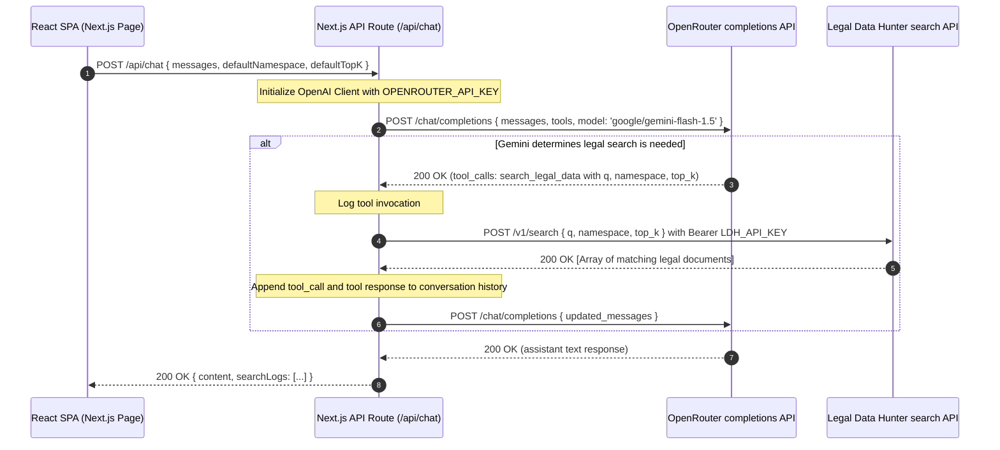

# Design Specification: Legal Data Hunter AI

A modern, highly-polished, and secure full-stack Next.js web application that enables users to query global legal databases using natural language. The system leverages Google's Gemini-1.5-Flash model via OpenRouter for advanced reasoning and function calling, which dynamically searches the Legal Data Hunter REST API.

---

## 1. Stack & Environment Configuration

### Frontend
- **Framework**: Next.js 15 (React 19, TypeScript)
- **Styling**: Tailwind CSS v4 (native compiler, modern CSS variable-based utility styles)
- **Icons**: `lucide-react`
- **Transitions/Animations**: Vanilla CSS transitions + Tailwind animations

### Backend
- **Framework**: Next.js App Router API Route Handler (`/api/chat/route.ts`)
- **OpenRouter SDK/Client**: OpenAI compatible client integration
- **Search Client**: Built-in Fetch with strict type definitions

### Core API Keys (Stored in `.env` / Server Environment)
- `OPENROUTER_API_KEY`: API key for accessing OpenRouter (`sk-or-v1-...`)
- `LDH_API_KEY`: API key for accessing Legal Data Hunter (`sk-DY1K-...`)

---

## 2. System Architecture & Flow

The application executes a full Server-Side Tool Loop (Approach A), ensuring all API keys and secondary search steps are secure and fast.



---

## 3. Tool & API Specifications

### Tool Definition (`search_legal_data`)
The Gemini-1.5-Flash model is initialized with the following tool definition:

```typescript
const searchTool = {
  type: "function",
  function: {
    name: "search_legal_data",
    description: "Searches the legal database for specific concepts, precedents, statutes, cases, or laws matching a natural language query.",
    parameters: {
      type: "object",
      properties: {
        q: {
          type: "string",
          description: "The targeted search query, optimized for legal context (e.g., 'breach of contract damages mitigation')."
        },
        namespace: {
          type: "string",
          description: "The legal database domain. Defaults to 'case_law'."
        },
        top_k: {
          type: "integer",
          description: "The maximum number of relevant documents to fetch. Defaults to 5."
        }
      },
      required: ["q"]
    }
  }
};
```

### Legal Data Hunter API Endpoint
- **URL**: `POST https://legaldatahunter.com/v1/search`
- **Headers**:
  - `Authorization: Bearer <LDH_API_KEY>`
  - `Content-Type: application/json`
- **Request Body**:
  ```json
  {
    "q": "<search query string>",
    "namespace": "case_law",
    "top_k": 5
  }
  ```

---

## 4. UI/UX Interface Design

A state-of-the-art dark mode interface combining responsive controls, visual log output, and beautiful animations.

### Header & Brand
- Dark slate header featuring an emerald-glowing pulsing dot indicating LDH network status.
- Premium typography using Google Fonts (e.g., "Outfit" or "Inter").

### Settings Panel (Sidebar)
- **Dynamic Config**:
  - Namespace selector (Dropdown or Pill selector: `case_law`, `statutes`, `regulatory`, `international`).
  - Search depth slider (`top_k` value ranging from `1` to `15`).
- **Status Panel**: Secure indicator confirming connection status to backend endpoints.

### Main Chat Interface
- **Feed**: Messages with glassmorphism styling (`backdrop-blur-md bg-slate-900/40 border border-slate-800`).
- **Expandable Search Accordion**: Whenever a message utilizes the search tool, a glowing accordion is embedded inline:
  ```
  [ 🔍 Legal Database Searched for "contract breach" (3 matches)  [v] ]
  ```
  Expanding it shows the parsed response objects from the Legal Data Hunter API, enabling trust and source verification.
- **Micro-Animations**:
  - Fade-in up transitions for messages.
  - Rotating spinner when searching.
  - Active wave visualizer when Gemini is typing/thinking.

---

## 5. Resilience & Error Handling
- **API Failures**: If the Legal Data Hunter API fails or times out, the backend returns a descriptive mock JSON response to Gemini (e.g., `{ error: "Service temporarily unavailable" }`). Gemini will gracefully explain the issue to the user.
- **Client Side**: Elegant toast notifications or inline error cards to inform users when network requests fail entirely.
- **Validation**: Strict validation of environment keys on backend boot, returning friendly HTTP 500 configurations with clear alerts if the server is unconfigured.
